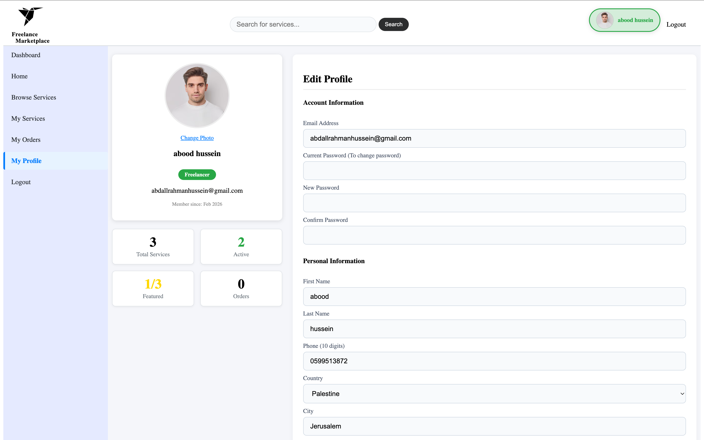

# 🚀 WorkWay - Freelance Marketplace (Ongoing Project)

**WorkWay** is a PHP-based marketplace platform designed to connect **Clients** and **Freelancers**. This project focuses on solid Backend architecture using Native PHP and MySQL to manage user roles and service listings.

> **Note:** This project is currently under active development to expand its features into a full-scale marketplace.

---

## 🛠️ Current Implemented Features

* **User Authentication System:** * Secure **Login** and **Registration** for two distinct roles: Client and Freelancer.
    * Session-based authentication that persists across the site.
* **Service Management (Freelancers):** * **Add Service:** Freelancers can post new services with descriptions, pricing, and image uploads.
    * **View Services:** A dynamic landing page to display all available services from the database.
* **User Profiles:** Dedicated profile pages for users to display their information.
* **Hybrid Image System:** A custom PHP logic that handles profile and service images, ensuring a default image is shown if no upload is found.
* **Security:** Using PDO prepared statements to prevent SQL Injection and `password_hash` for credential security.

---

## 🏗️ Technical Stack

* **Backend:** Native PHP (No external frameworks).
* **Database:** MySQL (PDO).
* **Frontend:** HTML5 & CSS3 (Pure CSS, no JavaScript used in the current version).

---

### 📸 Project Preview

#### Services Page (Service Display)

#### Profile page  

